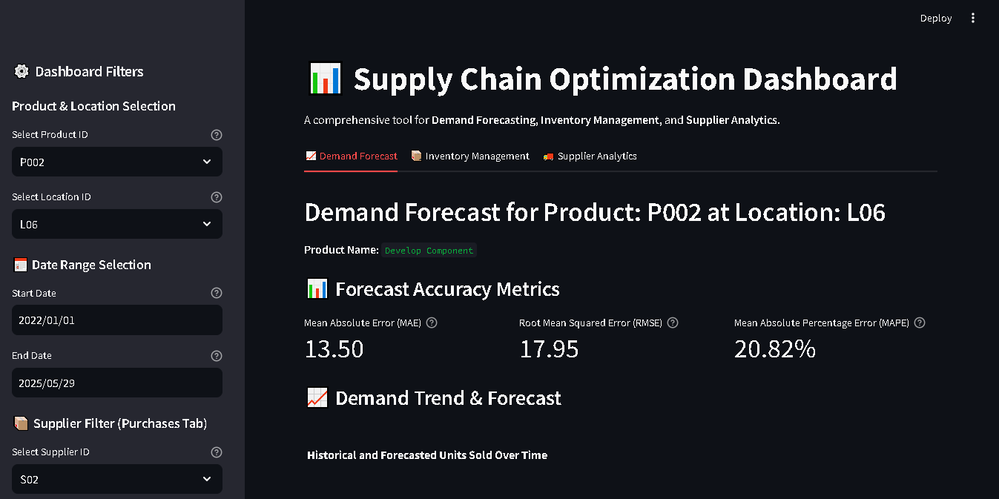
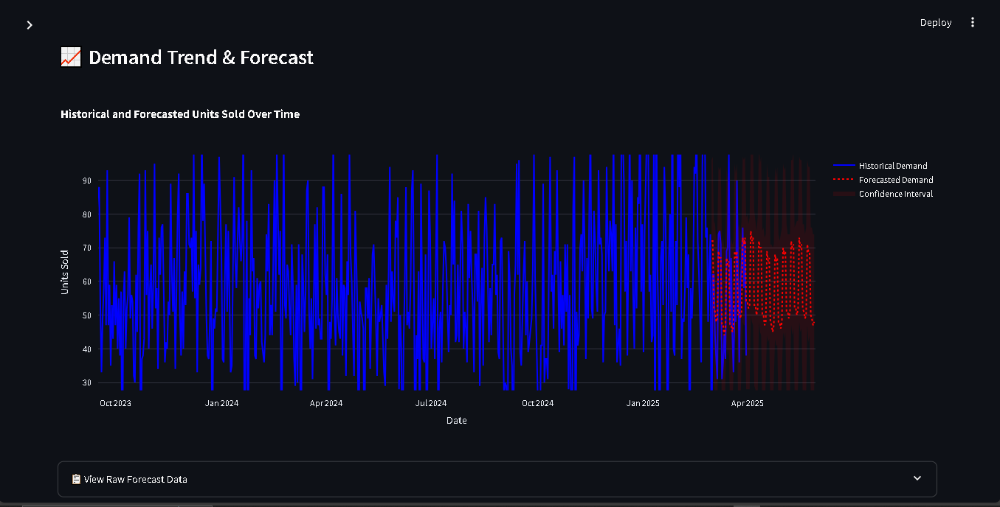
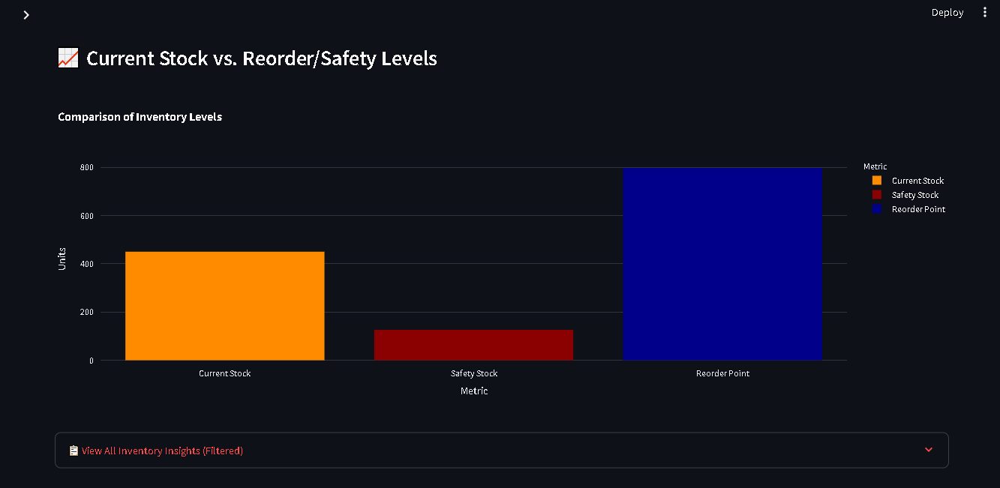

# Supply Chain Optimization Dashboard

## Project Overview

This project provides an interactive dashboard for optimizing supply chain operations. It covers Demand Forecasting, Inventory Management, and Supplier Analytics to help businesses make informed decisions regarding stock levels, future demand, and supplier performance.

The dashboard uses simulated data to demonstrate key functionalities.

## Key Features

* **Demand Forecasting:** Visualize historical demand and future predictions with accuracy metrics.
  
* 
  
* **Inventory Management:** Track current stock, calculate optimal safety stock, reorder points, and reorder quantities.
* **Supplier Analytics:** Monitor supplier performance, including on-time delivery rates and average lead times.
* **Interactive Filters:** Analyze data by product, location, supplier, and custom date ranges.

* 

## Technology Stack

* **Python:** Core programming language
* **Pandas:** Data manipulation
* **Prophet:** Time series forecasting
* **Streamlit:** Interactive web dashboard
* **Plotly:** Data visualization

## Maintainer

Vishal Sreeramareddy is a Supply Chain and Operations Professional with over 3 years of experience in project management, supplier coordination, and data-driven process optimization. As a PMP certified professional and Lean Six Sigma Green Belt, he specializes in leveraging advanced analytics (SQL, Python, Pandas) and ERP systems to drive operational excellence and inventory accuracy.

**Contact Information:**

* **Email:** vishal.venki163@gmail.com
* **LinkedIn:** https://www.linkedin.com/in/vishal-sreeramareddy